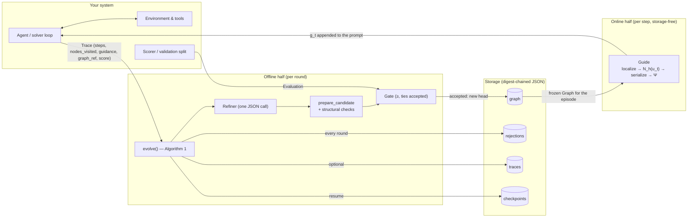
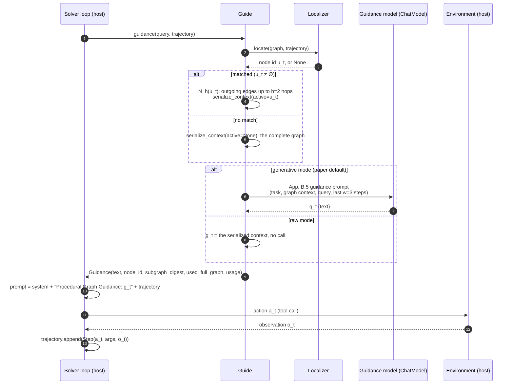
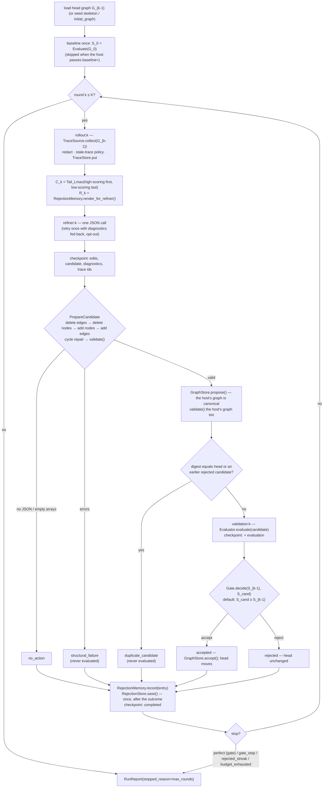
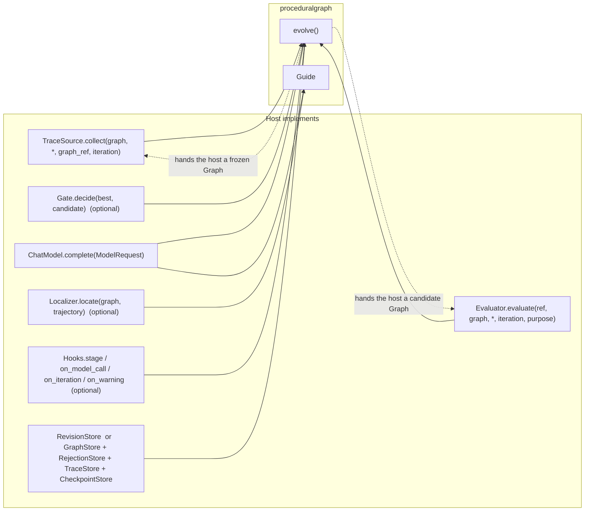
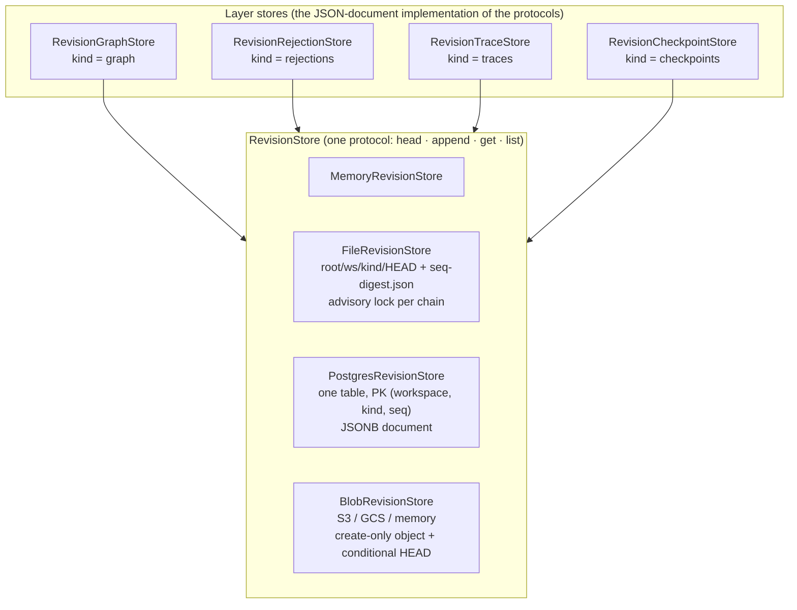
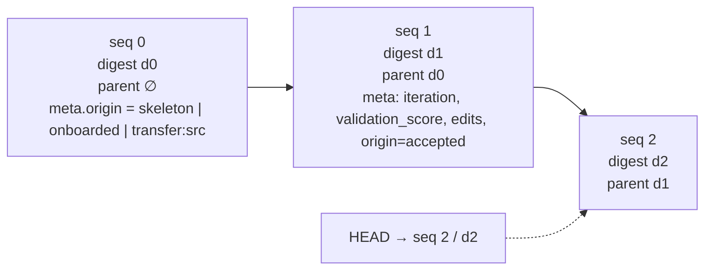
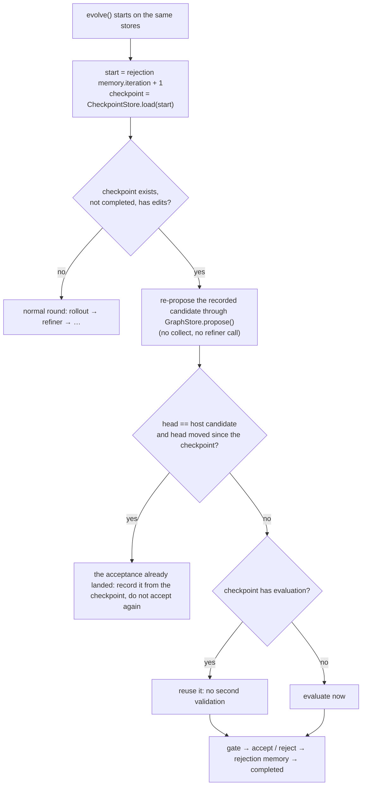

# Architecture

How `proceduralgraph` is put together: the online guidance half a host calls inside its agent loop, the offline
evolution half that edits the graph from traces, the seams a host implements, how everything is stored, and how model
spend is metered. Diagrams are Mermaid; GitHub renders them. Requirement ids (`C4`, `G3`, …) refer to
`REQUIREMENTS.md`; paper references are to arXiv:2609.09153.

## 1. The two halves and the one artefact



There is exactly one learned artefact, the **graph**: a directed attributed graph `G = (V, R, E, Φ)` whose nodes are
tools, reasoning steps or task statuses and whose edges carry `condition`, `guidance` and `pitfalls`. The online half
reads it; the offline half rewrites it. Everything else (rejection memory, traces, checkpoints) exists to make the
rewriting safe and explainable.

Module map (`src/proceduralgraph/`):

| Concern | Module | Key names |
| --- | --- | --- |
| Data model | `graph.py` | `Graph`, `Node`, `Edge`, `Diagnostic`, `Graph.validate`, `Graph.neighborhood` |
| Renderings | `serialize.py` | `serialize_context` (App. B.5 layout), `render_markdown`, `render_mermaid` |
| Online runtime | `guidance.py` | `Guide`, `GuidanceConfig`, `Localizer`, `ExactActionLocalizer`, `Guidance` |
| Edits and checks | `edits.py` | `EditSet`, `prepare_candidate`, `repair_cycles`, `unified_diff` |
| Refiner role | `roles/refiner.py` | `Refiner`, the App. B.5 prompt |
| Traces | `traces.py` | `Trace`, `Step`, `TaskOutcome`, `TraceSource`, `render_attempts_block`, `tail` |
| Rejection memory | `rejections.py` | `RejectionMemory`, `RejectionEntry` |
| Gates | `gates.py` | `Evaluator`, `Gate`, `TieAcceptingGate`, `StrictImprovementGate`, `PairedGate`, `ObjectiveGate` |
| Objectives | `objectives.py` | `MetricSpec`, `ObjectiveSpec`, `ObjectiveContext`, `paired_hoeffding_v1` (opt-in multi-metric acceptance) |
| The loop | `harness.py` | `evolve`, `evolve_sync`, `refine_once`, `RunReport` |
| Metering | `hooks.py`, `config.py` | `Hooks`, `HookedModel`, `BudgetMeter`, `Budget`, `EvolveConfig` |
| Storage | `stores/` | `RevisionStore`, `GraphStore`, `RejectionStore`, `TraceStore`, `CheckpointStore`, adapters |
| Model transport | `model.py`, `adapters/` | `ChatModel`, `ModelRequest`, `ModelResponse`, Anthropic / OpenAI adapters |
| Operator | `cli.py` | `init`, `show`, `export`, `history`, `diff`, `rejections`, `transfer`, `guide` |

## 2. Online guidance: one solver step

Paper §3.2, eq. 2 and 3. A `Guide` is built once per episode over a **frozen** graph (C4) and called before every
solver action. It never touches storage (C6).



What the host keeps from the episode, for the offline half: `guide.visited` (the node ids localized, in order) and
`guide.guidance_log` (every `Guidance`), copied into `Trace.nodes_visited` and `Trace.guidance`, plus the revision it
served as `Trace.graph_ref` (C7, D3).

Modes (`GuidanceConfig.mode`): `generative_subgraph` (paper default), `generative_full`, `raw_subgraph`, `raw_full`,
`none`. The raw modes and `max_guidance_calls` are the cost controls; `none` is the no-graph baseline for A/B tests.

## 3. Offline evolution: one round of Algorithm 1

Paper §3.3 and App. B.6. `evolve()` runs up to `K = max_rounds` rounds; each round ends in exactly one of five
outcomes and writes exactly one rejection-memory entry.



Points that matter in production:

- **Only accepted graphs join the graph chain.** Candidates live in memory (or wherever the host's `propose` puts
  them) until `accept`. A rejected candidate never becomes the next round's starting graph (Alg. 1 line 4).
- **Structural failures and duplicates never reach the evaluator.** Validation is the expensive stage; the loop refuses
  to pay it for a graph it already knows the answer for (Alg. 1 lines 11–13; F3).
- **Rejection memory is written once per round, after the outcome is known** (G4). Between the refiner stage and that
  save the round is protected by the checkpoint, not by a provisional entry.
- **The refiner sees the full search trace**: the most recent non-accepted rounds in full (edit JSON, score or
  diagnostics), older rounds and accepted rounds one line each.
- **Mode** is `scratch_incremental` while the head is the skeleton and `static_incremental` afterwards; the one-time
  modes of the paper's ablation are only reachable through `refine_once()`.

## 4. Integrating with a host

Everything the host provides is a small `async` protocol. The loop never scores anything, never runs an agent and
never talks to a database directly.



The two host stages that run agents:

| Stage | Who runs the agent | What it returns | Where the `Guide` comes from |
| --- | --- | --- | --- |
| `rollout:k` | `TraceSource.collect` | `list[Trace]` scored on the training batch, or production episodes that already ran under `graph_ref` and later got a score | The host builds `Guide(graph, model, config)` per episode |
| `baseline` / `validation:k` | `Evaluator.evaluate` | `Evaluation(ref, score, per_task)` on the held-out validation split | Same, over the candidate graph the loop passes in |

Where a host plugs its own concerns in:

- **Leases and idempotency**: `Hooks.stage(name)` wraps `baseline`, `rollout:k`, `refiner:k`, `validation:k`.
  `GraphStore.propose` is idempotent per `(iteration, edits)` by contract because resume calls it again.
- **Its own tables**: implement `GraphStore` (`load`, `seed`, `propose`, `accept`) and `RejectionStore` directly; the
  graph the host returns from `propose` is what gets validated and served (G3), and it is run through the structural
  checks first.
- **Its own action format**: `ExactActionLocalizer(normalize=...)` or a full `Localizer`.
- **Redaction**: `evolve(redact=regex_redactor({...}))` runs before the refiner, the trace store and rejection memory.
- **Stale traces**: `Trace.graph_ref` plus `stale_trace_policy` (`warn` default: kept and marked `STALE` in the
  refiner's context; `drop`; `allow`).

`docs/host-integration.md` has the wiring in code.

## 5. Storage

One primitive, `RevisionStore`: an append-only chain per `(workspace, kind)` whose `append` refuses to fork
(`expected_head` must equal the current head's digest, else `HeadMoved`). Everything above it is a JSON document.



The chain itself:



- `digest` is SHA-256 of the canonical JSON of `document` only, so identical content has an identical digest and a
  graph revision's digest equals `Graph.digest`.
- `list` and `get` on every adapter **follow the committed chain** from HEAD through `parent_digest`; an object a
  losing writer left behind is never read back.
- Fork refusal is enforced by the backend where one exists: the Postgres primary key, S3 `If-None-Match` /
  `If-Match`, GCS generation preconditions; the file store uses a per-chain lock on one machine.
- The four chain kinds do not collide with `skillwiki`'s, and the `RevisionStore`, `Revision` and `HeadMoved` shapes
  are byte-for-byte skillwiki's, so a host can back both packages with one adapter and even one table.
- `GraphStore` is the abstraction; the JSON document is its first implementation (H4a). A graph database can sit
  behind the same four methods later.

Document shapes, in one line each:

| Kind | Document | Written when |
| --- | --- | --- |
| `graph` | `Graph.to_document()`: `schema`, sorted `nodes`, sorted `edges`, `relations`, `attribute_fields`, `node_types`, `meta` | seed, and every acceptance |
| `rejections` | `RejectionMemory.to_document()`: `schema`, `iteration`, `entries[]` (kind, edits, candidate, digests, trace ids and scores, validation, diagnostics) | once per round |
| `traces` | `schema`, `iteration`, `traces[]` (`Trace.to_document()`) | once per round, if a `TraceStore` is given |
| `checkpoints` | `iteration`, `payload` (`edits`, `candidate`, `candidate_digest`, `diagnostics`, `trace_ids`, `trace_scores`, `mode`, `objective` binding in objective mode; then `+ host_candidate_digest`, `host_ref`, `evaluation`, `baseline_evaluation`, `baseline_ref`; then `+ decision`; then `completed`) | after the refiner, after validation, after the gate, after the round |

The exported files (`graph.json`, `graph.md`, `graph.mmd`, `rejections.md`) are renderings of these documents, never
the storage.

## 6. Metered usage and budgets

Every model call in the package goes through one object, `HookedModel`, which checks the budget **before** the call
and records usage after it. The loop wraps the host's model in one; a host that shares that same `HookedModel` with its
`Guide`s has guidance calls metered under the same ceiling (G9).

```mermaid
sequenceDiagram
    autonumber
    participant E as evolve()
    participant R as Refiner
    participant G as Guide (host rollout)
    participant HM as HookedModel
    participant BM as BudgetMeter
    participant M as ChatModel (provider)
    participant H as Hooks

    Note over E,BM: BudgetMeter(config.budget): max_model_calls · max_output_tokens · max_evaluations · max_seconds
    E->>H: stage("refiner:k") enter
    R->>HM: complete(request role=refiner)
    HM->>BM: check(about_to="model_call")
    BM-->>HM: ok, or raise BudgetExceeded
    HM->>M: complete(request)
    M-->>HM: response + usage
    HM->>BM: model_calls += 1; output_tokens += usage
    HM->>H: on_model_call("refiner", request, response)
    E->>H: stage exit
    E->>BM: check(about_to="evaluation")
    E->>H: stage("validation:k") enter
    G->>HM: complete(request role=guidance)  (same meter when shared)
    HM->>BM: check / record as above
    E->>BM: evaluations += 1
    E->>H: stage exit
    E->>H: on_iteration(IterationReport) · on_warning(...)
```

Rules of the meter:

- A check that fails raises `BudgetExceeded` before spending. The loop turns it into `stopped_reason="budget_exhausted"`
  and abandons the current round without persisting it; everything already saved stays saved, and the checkpoint stays
  so a later run with more budget finishes the round.
- `max_evaluations` counts the baseline too. `max_output_tokens` needs the provider to report usage
  (`output_tokens` or `completion_tokens`); a model that reports nothing cannot exhaust it.
- `ModelRequest.role` is `refiner` or `guidance`, so a host can price and admit the two separately in
  `on_model_call`.
- `RunReport.budget` returns the totals and ceilings for the run.

## 7. Crash recovery



The perfect-score probe runs only when nothing is pending, so a round whose acceptance landed but whose memory save
was lost is reconciled first.

## 8. Round outcomes and stop reasons

| Outcome | Meaning | Evaluated? | Head moves? |
| --- | --- | --- | --- |
| `accepted` | gate accepted the candidate | yes | yes |
| `rejected` | gate refused it; with `ObjectiveGate` the recorded `decision.disposition` says why: `rejected` (measured loss), `equivalent`, `unresolved`, `unmeasured` or `invalid`. Only a measured `rejected` feeds duplicate refusal | yes (or deferred) | no |
| `structural_failure` | edits could not be parsed or applied, or the (host's) candidate failed `validate()` | no | no |
| `no_action` | the refiner returned four empty arrays | no | no |
| `duplicate_candidate` | digest equals the head or an earlier rejected candidate | no | no |

| `stopped_reason` | Cause |
| --- | --- |
| `max_rounds` | all `K` rounds ran (the paper's behaviour) |
| `rejected_streak` | `max_rejected_streak` consecutive non-accepted rounds (opt-in) |
| `perfect` | the gate's `perfect` score reached (opt-in; probed on the baseline and after each acceptance) |
| `gate_stop` | a custom gate returned `stop=True` for another reason |
| `budget_exhausted` | a `Budget` ceiling was hit before a paid step |

## 9. Glossary

- **G_k, head**: the retained graph after round k; the newest revision on the `graph` chain.
- **u_t**: the node the agent is localized at before step t; `Start` before the first action.
- **N_h(u_t)**: the active node plus outgoing transitions within h hops; what the guidance model sees.
- **g_t**: the guidance text appended to the solver prompt at step t.
- **E_k, C_k, R_k**: the round's traces; their concatenation cut from the front to `L_max`; the serialized rejection
  memory. All three go into the refiner prompt.
- **ΔG_k**: the refiner's edit set: `add_nodes`, `delete_nodes`, `add_edges`, `delete_edges`.
- **Candidate**: `G_{k-1} ⊕ ΔG_k` after cycle repair and the structural checks, materialised by the host's `propose`.
- **Validation, S_val**: the mean task score on the held-out split, from the host's `Evaluator`.
- **Revision, digest, ref**: one immutable document in a chain; its SHA-256; the host-opaque identity the loop passes
  around (the digest for the default stores).

---

Written by [Vikash Ranjan](https://www.linkedin.com/in/vikash-ranjan-stylsai/), CTO, [styls.ai](https://styls.ai). Apache-2.0.
